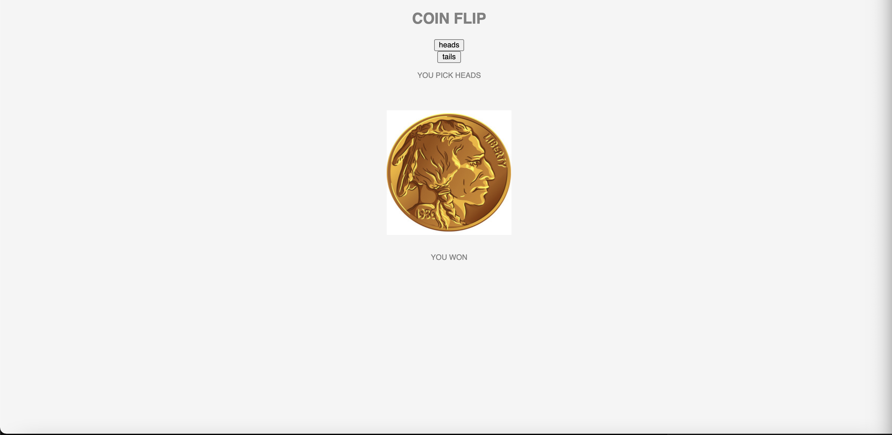

## Installation

1. Clone repo
2. run `npm install`

## Usage

1. run `node server.js`
2. Navigate to `localhost:3000`

## Credit

Modified from Scotch.io's auth tutorial

</img>

Link to live site: [https://danielmtran-coinflip-express.netlify.app]